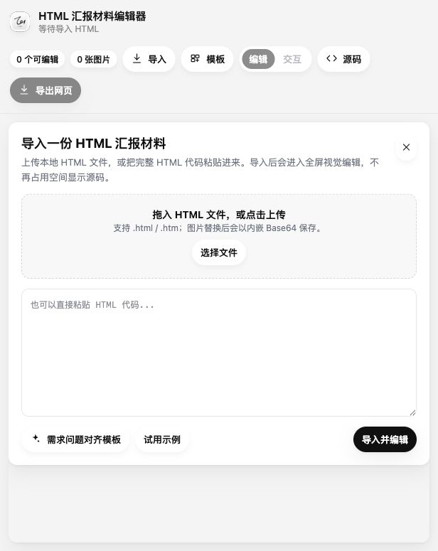

# HTML Report Editor

一个本地运行的 HTML 汇报材料编辑器。它可以导入 HTML，在预览里直接编辑文字、图片和布局，使用内置模板生成页面，并导出干净的 HTML 文件。



## 功能

- 导入本地 `.html` / `.htm` 文件或粘贴 HTML 片段
- 编辑模式默认禁用页面脚本，降低打开陌生 HTML 的风险
- 交互模式可运行页面脚本，用于检查原页面交互
- 直接编辑文字、替换/插入图片、插入文本框
- 支持页面管理、新建页面、复制页面、删除页面
- 支持常用 PM 模板和自定义模板保存
- 支持组件复制、拖动、对齐、等距分布、匹配尺寸
- 支持页面层组件的置顶、置底、上移一层、下移一层
- 导出为单个 HTML 文件

## 本地预览

直接用浏览器打开：

```bash
open src/html-report-live-editor.html
```

或者启动本地服务：

```bash
cd src
python3 -m http.server 8765 --bind 127.0.0.1
```

然后访问 `http://127.0.0.1:8765/html-report-live-editor.html`。

## Windows / Linux 使用方式

当前 `.app` 发布包只适用于 macOS。Windows 和 Linux 用户可以直接运行网页版本：

```bash
git clone https://github.com/liuyuplus/html-report-editor.git
cd html-report-editor/src
```

Windows:

```powershell
py -m http.server 8765 --bind 127.0.0.1
```

Linux:

```bash
python3 -m http.server 8765 --bind 127.0.0.1
```

然后在浏览器打开：

```text
http://127.0.0.1:8765/html-report-live-editor.html
```

如果没有 Python，也可以使用 Node.js：

```bash
npx serve src
```

## 构建 macOS App

```bash
./scripts/build-mac-app.sh
```

构建结果会生成在 `dist/HTML报告编辑器.app`。

## Beta 下载

当前版本建议作为 beta 预览使用。下载 GitHub Release 里的 `.zip` 后，解压并打开 `HTML报告编辑器.app`。

如果 macOS 提示来自未知开发者，可以在 Finder 里右键 app，选择“打开”。后续如果面向更多普通用户分发，建议做正式签名和 notarization。

## 安全说明

编辑模式会把导入 HTML 中的脚本置为不执行；交互模式会恢复并运行页面脚本。建议只在交互模式打开可信 HTML。

所有导入、编辑、图片替换和导出都在本地完成，当前版本不会上传 HTML 或图片。

## 许可证

MIT
